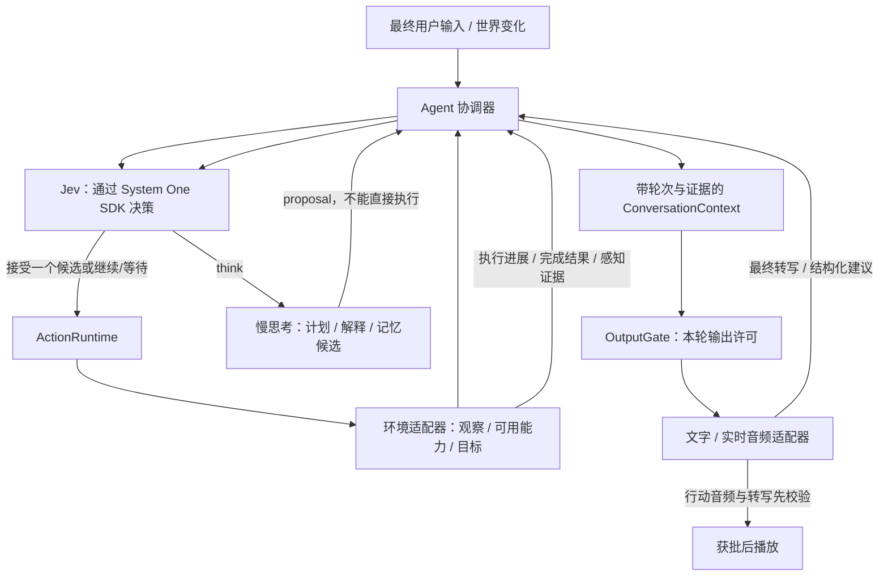
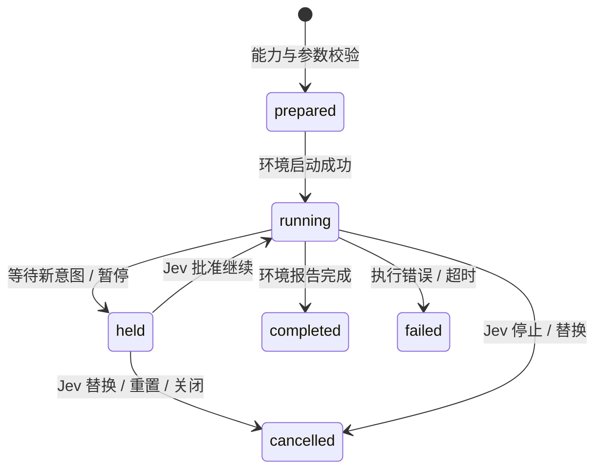

# RealtimeAgent：独立 Agent 架构

日期：2026-09-18。设计版本：0.2。包：`@realtime-agent/agent`，目录：`packages/agent`。包尚未发布，工作区版本仍为 0.1.0。

2026-09-20 增量：异步操作回执、多通道、观察时效与短任务计划，以及 Computer/角色表现首批接入已完成。本文保留原设计与历史验收；最新接口和范围见 [通用运行时实施记录](realtime-runtime-implementation.md)。持久恢复与原生桌面仍属后续阶段。

本文是新架构的设计和迁移契约。实现范围按文末里程碑区分，不能将目标架构当作已经通过完整语音验收的功能。

## 1. 要解决的问题

“去床边看看”与“睡一会儿”是不同的行为。前者只改变位置并获得新的观察，后者还包含睡眠交互及效果。物体 `bed` 不应该用行为 ID `sleep` 表示；用户也不应靠说出某个固定生活动作才能让身体移动。

旧 Home 把动作候选、寻路、需求、人格、模型调用、对话状态和语音桥接放在同一个运行时中。原生语音另外并行生成回复，导致它说“我正在过去”时，身体可能尚未收到有效决策。增加提示词只能降低这种情况的概率，不能建立程序上的一致性。

新架构的核心是三个独立事实：**模型提出了什么、控制器接受了什么、环境实际发生了什么**。三者必须通过带版本的结构化记录连接。

## 2. 总体结构



| 层 | 负责 | 不负责 |
| --- | --- | --- |
| System One SDK | provider 协议、鉴权、问题类型、返回校验、取消和请求预算 | Agent 生命周期、物理世界 |
| Agent 协调器 | 输入轮次、请求节奏、失效隔离、决定是否调用慢思考、采纳建议 | Three.js、音频设备、环境持久化 |
| ActionRuntime | 注册能力、准备与启动、保持/继续/取消、执行回执、主动执行时间上限 | 硬编码床/家具/坐标，猜测任务已经成功 |
| Environment | 当前可见信息、当前候选、能力实现、前置条件、执行和真实效果 | 替模型决定下一件事 |
| Cognition | 复杂推理、计划建议、人格表达、记忆候选 | 直接调用身体、更改已完成状态 |
| Conversation | 连续说听、展示状态、引用执行和观察证据 | 把自然语言承诺当成动作调用 |
| OutputGate | 轮次许可、取消、时效、精确文本匹配 | 判断所有自由文本的语义真实性 |

每个 Agent 实例拥有自己的轮次、执行器、历史和请求槽位。内核没有进程级共享 Agent、环境变量读取、文件路径、HTTP 路由或用户身份系统。

## 3. 对象、能力与候选

对象和动作分离：

```ts
{ capability: 'move_to', target: 'bed' }
{ capability: 'inspect', target: 'bed' }
{ capability: 'use', target: 'bed', input: { activity: 'sleep' } }
```

`move_to`、`inspect`、`use` 是环境注册的能力名，不是内核枚举。浏览器环境可以注册 `click`、`fill`；桌面环境可以注册窗口操作；游戏环境可以注册拾取、开门和交互。只有环境实际实现并在本次观察中提供的能力可以进入候选。

第一版采用**已经绑定参数的候选**：一个 candidate ID 对应一份完整 `ActionCall`。例如 `move:bed` 与 `use:bed:sleep` 是两个候选。Jev 通过 SDK 的 `choice()` 一次选择一个 candidate，应用从发起时保存的映射取回调用对象。目标和动作不会由两个互不关联的问题任意拼接。

这是第一版的规模取舍：几十个实例候选可直接枚举；大规模动态对象可在后续使用 SDK `defineDecision()` / `choiceFrom()` 做分层参数选择。协议与基础答案校验继续交给 SDK，不能在应用重新实现一套 Jev HTTP codec。

环境必须在执行前再次校验目标、参数、权限和前置条件。模型看到过的候选可能在返回前失效。`prepare()` 只能检查和构造执行计划；不得施加世界效果。准备失败时保留已有动作。完成新计划准备后才能取消旧执行。

## 4. 动作生命周期



每个执行都有独立 `executionId`、`scope`、完整调用、状态、阶段、进度、主动执行时间、起止时间和结果。回执快照与返回的历史都是副本，调用方不能通过改快照伪造成功。

`running` 表示执行器已启动，不代表物理动作完成；`phase` 进一步区分 walking、acting 等环境阶段。`held` 不应被说成正在走路。只有环境 `step()` 返回 completed 才会生成完成回执。取消不会授予完成效果；到达床边不授予睡眠效果。

第一版能力执行采用同步、有界的 `start/step/cancel` 端口，适合模拟世界与游戏 tick。异步网络/桌面操作适配器需要后续增加显式停止确认与提交结果协议；不能将 `AbortSignal.abort()` 当成远程副作用已经撤销。内核不宣称跨网络 exactly-once。

执行超时计算**实际运行的模拟时间**，held 不增加执行时间。物理倍速只影响环境推进，不缩短模型请求间隔。环境可报告执行失败；错误原文不进入公共回执。

## 5. 时间、并发和输入

`Scope = { epoch, turnId, revision }`。epoch 标识一次 Agent 会话；turnId 标识最终用户输入；revision 用来使旧决策/旧建议失效。世界逐帧位置变化不应无条件增加决策语义版本，避免模型响应永远过期。

第一版默认两次 Jev 请求开始至少间隔 1,000 ms，一个决策槽位、一个慢思考槽位。无新输入、环境变化、完成结果或待采纳建议时，不反复询问模型。主动等待按观察间隔重评。SDK `maxRetries=0`，由协调器管理重试，避免两层重试产生看不见的调用。

最终输入取消旧模型请求，使旧 proposal 失效，暂缓正在进行的可逆动作；Jev 选择继续、等待或替换。保留有限的前文用于指代消解，但不把旧请求全部重新执行。语音中间转写仅用于正在聆听的状态，不进入身体。

对话取消和身体取消是不同操作。新声音到来可以立刻停止旧音频输出；最终文本尚未确定时，不应随意启动新动作。独立包暴露 `holdInput/releaseInput`，设备检测和静音超时由语音适配器负责。

外部语义变化通过 `invalidate()` 或环境的 revision 进入版本检查。请求即使忽略 abort 后才返回，仍须比较 scope；过期结果不能执行、回复、写入 proposal。pause/reset/dispose 同样使未完成推理失效，取消不会重置速率或提供商退避。

## 6. Jev 与慢思考协作

Jev 选择下一项候选、是否打断、是否请求慢思考、是否采纳当前 proposal 和是否结束本轮。概率阈值是可配置业务策略；置信度用于诊断，不给可逆生活动作默认增加一个导致瘫痪的最低置信度门槛。

慢思考通过 `SlowThinker.think(context, signal)` 提供 summary、可选回复、建议调用和记忆候选。调用只能来自 Jev 的 think 决策。返回后仍是 pending proposal，下一次 Jev 决策可以采纳或拒绝；suggestions 不会自动送进执行器。建议列表不是任务队列。

复杂任务后续使用 Task/Plan：语义目标、约束、完成证据、候选下一步。Jev 决定当前一步，Environment 确认效果，慢思考按需修改计划。`complete=true` 只是模型判断；内核还检查等待状态、没有未完成执行，以及本轮完成回执、已采纳回复或已经送达的原生回复。宿主可通过 `AgentPolicies.verifyCompletion` 实现停止、对象本来已满足条件等领域规则，复杂多步骤任务的完整验收仍需领域 goal verifier。

人格、偏好和历史观察分别管理。事实记忆应记录对象、属性、来源观察、时间和版本；用户偏好保留原话来源；人格是稳定配置。Home 的 LifeStore、人格与 `acceptInsight` 作为宿主策略接入 `AgentPolicies`，由内核统一管理慢思考槽位、冷却、过期和采纳时机。独立包保留有界执行历史和 proposal；持久化事实记忆尚未实现。

宿主通过 `subscribe(AgentEvent)` 投影 UI、轮次延迟、事件轨迹和存储。事件数据是副本；观察者异常不会重放已经提交的动作。模型结果与 proposal 可携带 JSON `metadata` 供领域适配器使用。删除记忆时，宿主同时调用 `forgetTurns` 移除原用户输入，并取消引用旧上下文的推理。

## 7. 感知和“说到做到”

Environment 的 `observe` 提供推理上下文，`perceive` 可提供单独的公共感知投影，避免把私人记忆或人格策略上下文直接送给播放适配器。Home 当前“近距离看到”是距离阈值加预定义外观描述的模拟传感器，**不是视觉模型，也没有视锥、遮挡或截图识别**。后续可替换传感器，不改变 Agent 决策接口。

每次观察产生 evidence：ID、epoch、revision、采集时间、过期时间和事实。过去的观察可以作为“上次看到”的记忆，不能直接当作当前视觉。未知属性必须保持未知。

对话上下文包含当前执行、近期终态回执、最新观察和 scope。结构化 claim 可引用：

* 某 executionId 目前 running / held / completed；
* 某 observationId 在当前 epoch/revision 内仍有效。

`checkClaims()` 检查引用的真实记录、轮次和新鲜度，拒绝未到达便声称 completed、旧轮次动作冒充新任务、取消后的执行声称正在运行等情况。**它不理解任意回复文本，因此不能证明自由文本与 claim 语义完全一致。**

所有说话都走可执行能力 `speak`。慢模型提出原文，Jev 在同一次决策中分别选择身体候选和输出候选，并审核 pending proposal。采纳提议不会发言；只有 `output={kind:"execute",call:{capability:"speak",target:proposalId,input:{text}}}` 才启动输出。`silent` 停止发言，`continue` 继续已经获准的发言。身体和说话共用 `ActionRuntime` 的执行契约，各占一条可并行通道。

Home 的 `speak.prepare` 检查提议已采纳、轮次仍有效、原文一致且未执行过；文本交付与原生音频播放完成都产生终态回执。观察完成只提交事实，不生成话术。对于查看任务，完成判定要求观察回执和引用该观察证据的已交付 speak 回执；提前回应不算观察回答。同一轮允许多次独立决定的发言。

`VoiceBridge.outputPlan()` 只读取当前获准的 speak 执行，并将许可绑定执行 ID、原文、会话和有效期。LiveKit 订阅执行变化；浏览器直连复用世界 SSE 的执行状态；两者均不以“每句输入必须回答一次”作为触发条件。自主发言也使用同一能力，不虚构用户轮次。插话、新输入、暂停、重置、关闭会话会撤销输出；切换语音模式使身体进入 held，必须重新决策才能继续。

原生音频模型只朗读选定原文。LiveKit 丢弃未经许可的 generation，完整缓冲音频与转写；OpenAI 关闭自动 response，接收轨道静音，用 MediaRecorder 缓冲。转写匹配后才允许播放。保留 20 秒生成期限、30 秒许可期限和 4 MiB 音频上限；错误输出使 speak 失败，不能自行改写或重试。自由聊天也走同一校验，没有流式绕过路径。这会增加首音延迟，但身体可以继续执行。

**保证边界：**自然语言是否准确由慢模型和 Jev 审核，原文匹配只证明音频模型遵守获准措辞；它不能证明所有句子的语义正确。校验依赖提供商转写，未使用独立 ASR 核验波形。物理麦克风与声学回声仍需单独验收。

## 8. 独立包 API 与边界

```ts
import { Agent, ActionRuntime } from '@realtime-agent/agent';
import { SystemOneDecisionPolicy } from '@realtime-agent/agent/system-one';
import { SystemOne } from '@system-one-ai/sdk';
import { cloudflareAdapter } from '@system-one-ai/sdk/adapters/cloudflare';

const fast = new SystemOneDecisionPolicy(new SystemOne({
  adapter: cloudflareAdapter({ accountId }), apiKey, maxRetries: 0,
}));
const agent = new Agent({ environment, fast, slow });
agent.receive('去床边看看');
// 宿主控制时间；不需要启动 HTTP 或加载 Three.js。
agent.tick(0.1);
await agent.decide();
const context = agent.conversation();
```

核心入口不导入 Node 内置模块、React、Three.js、LiveKit、Cloudflare 或 System One SDK 的运行时代码。Jev 实现放在单独的 `/system-one` 导出，接收 SDK `EvaluationClient`。默认 adapter、baseURL 和凭据由宿主构造；内核不从 URL 猜供应商。

交付 ESM JavaScript、类型声明和源码映射，允许 `npm pack` 后在独立消费目录安装。支持类型检查和离线测试。当前验证目标为工作区现用 Node；浏览器/Workers 的 API 兼容性是设计约束，未经执行验证不得宣称全部平台验收通过。

## 9. Home 迁移

采用可验证的分层迁移，保留现有 UI/SSE 和人格持久化接口。

第一步：Home 从新包调用 `ActionRuntime` 和 `SystemOneDecisionPolicy`；寻路、坐标、家具条件、需求效果封装到 Home environment。Home 的旧 `approach + target=sleep` 只作为兼容 UI 的边界表示，内核看到的是 `move_to + target=bed`。从 Home runtime 删除对应动作推进代码，避免维护两份执行算法。

第二步已完成：Home 直接实例化独立 `Agent`。原有独立 fast/slow AbortController、重试时间、决策冷却和 proposal 调度已删除。Home 保留物理/广播时钟、HTTP 去重、人格策略和存储，模型调度及旧结果隔离由内核统一处理。`WorldState` 和轮次统计通过生命周期事件投影，前端仍使用原有协议。

第三步的受控输出已实现：说话是 Jev 显式选择的能力，原生音频只渲染获准提议并经过播放前许可。LiveKit 与浏览器 WebRTC 都覆盖正确/错误输出的真实媒体回归。持续自动观察播报、持久化事实记忆以及完整任务计划验证属于剩余扩展。

2026-09-19 补充：单目标 `inspect:<target>` 支持物体和房间。到达后返回观察，Jev 再决定慢思考与 speak；没有自动观察播报。当前每轮一个观察目标，尚无多目标任务计划或长期事实记忆。

## 10. 验收场景

| 场景 | 要求 |
| --- | --- |
| 问远处床的颜色 | 没有当前观察就不提供颜色事实 |
| “你过去看一下” | 根据前文选择 inspect(bed)，实际移动，到达读取观察后主动回答 |
| 到床边后问颜色 | 新观察包含外观，引用当前 evidence |
| 随后说“睡一会儿” | use(bed, sleep)，等待交互完成后才结算精力 |
| 行走中改去书架 | 保持实际位置，旧执行 cancelled，新目标独立执行 |
| 等待 Jev 时先回“正在走” | claim 校验拒绝 held/未启动执行为 running |
| 旧 LLM / 旧 Jev 迟到 | 不执行、不采纳、不污染当前轮次 |
| 模型错误 / 非法目标 | 有界重试，保留真实状态，不切换成本地模拟 |
| 暂停、重置、两 Agent 并行 | 不授予未完成效果，不串轮次、状态或证据 |
| 环境动态取消一个候选 | 发起时与执行前都检查，拒绝过期能力 |

验证分三层记录：离线内核与真实本地执行器测试、Home 集成与浏览器测试、可选真实 Cloudflare Jev 请求。模型 fixture 不冒充模型联调；文字联调不冒充物理麦克风和实时音频验收。

## 11. 实现里程碑

**M1，已实现并验证**：可独立构建的包、能力执行器、协调器、SDK 决策适配、有界回执与感知证据、claim 引用检查、Home 动作层接入。

**M2，协调与播报已交付**：Home 完成协调器迁移；人格和持久化通过宿主策略与事件接入；公共感知投影；原生语音的结构化播报路由、许可、缓冲校验和取消。持续观察推送、持久化事实记忆和完整计划验证尚未交付。发布状态仍为 private workspace package，未发布 npm。

**M3**：异步设备/浏览器执行器、取消确认、持久化恢复、跨进程授权和幂等、更多环境与并行能力。未实现的能力不得注册成“可执行”。

## 12. 依据

本设计的问题和旧行为依据本仓库 `apps/realtime-home/server/runtime.ts`、`server/providers.ts`、`server/voice/{bridge,livekit,profiles}.ts`、`shared/{types,world}.ts`。上述路径描述的是迁移前的职责与已有兼容边界。

SDK 使用契约以安装包 `@system-one-ai/sdk@0.5.2` 的 README、`EvaluationClient` 类型与 adapter 实现为准。npm registry 于本轮查询返回 latest=0.5.2。公开 GitHub 页面检索本轮未能取得内容，未将网页内容作为独立验证依据。

## 13. M1 历史验证记录

实现入口：`packages/agent/src/{agent,actions,evidence,system-one,types}.ts`。Home 通过 `server/agent-environment.ts` 注册 `move_to` / `inspect` / `use`，并由 `server/runtime.ts` 使用包内执行器；`server/providers.ts` 使用包内 SystemOneDecisionPolicy。独立示例 `packages/agent/examples/local.ts` 展示没有 Web 服务、3D 和模型调用时的完整运行方式。

Home 兼容层继续对 UI 返回 `approach/target=sleep`，但新包回执记录 `move_to/target=bed`。通过一项完整候选来绑定能力与目标后，原来的独立 target 问题已删除。两个应用均安装正式 SDK 0.5.2，不再依赖相邻的 SDK 本地仓库链接。

| 验证 | 结果 | 范围 |
| --- | --- | --- |
| Agent 包类型检查 / 构建 | 通过 | ESM、声明、源码映射；核心无 Home / Three.js / Node 文件系统依赖 |
| Agent 离线测试 | 25/25 | 生命周期、准备失败保留旧动作、取消失败阻止重入、迟到结果、慢思考隔离、候选撤回、证据过期、多个 Agent 隔离、自主行为不冒充旧任务 |
| Home 离线测试 | 102/102 | 原有调度、人格、语音桥接与三项新增独立包接入测试 |
| Config / Demo 测试 | 12/12、18/18 | 既有配置、SDK 调用和 Demo 运行时回归 |
| 工作区类型检查 / 应用构建 | 通过 | 新联调脚本的类型错误已修复并重新通过 Home 检查/构建；保留原有大分块体积提示 |
| Home 浏览器回归 | 8/8 | Chrome，无真实模型；包括 3D 页面、390px、行为切换、慢思考、模拟语音事件和缺密钥界面 |
| 独立安装验证 | 通过 | tarball 安装在工作区外的临时消费项目；未安装 System One SDK，核心仍可导入并执行能力 |
| 真实 Cloudflare Jev | 5 次请求通过 | SDK 0.5.2、真实模型选择、真实 Home 执行器，手动推进模拟时间；没有真实 LLM 或实时音频调用 |

真实模型场景依次验证“床是什么颜色，你还记得吗？”不擅自行动；“你过去看一下呀”通过前文选择床并实际到达；“请睡一会儿”执行 use 后才恢复精力；随后向书架移动时改口去沙发，书架执行被取消、沙发执行完成。报告保存在 `apps/realtime-home/test-results/agent-live/verification-1789734602005.json`。此处只验证转写文本到身体的链路，不声称复验了整段自然语音对话。

浏览器首次回归为 7 通过、1 失败：缺密钥页面用例读到了本地真实 Cloudflare 配置，模型选项变成 2 项，而测试预期 7 项。现在普通 Playwright 服务明确使用 direct/demo，并将模型和语音凭据置空；原断言保持，完整复跑 8/8 通过。测试配置不会修改用户 `.env`。

独立包安装报告：`test-results/agent-package/verification.json`。安装包：`test-results/agent-package/realtime-agent-agent-0.1.0.tgz`。临时消费项目由验证脚本在结束时清理。所有测试和联调均在前台完成，未留下验证服务。

重跑入口：

```sh
pnpm --filter @realtime-agent/agent example:local
pnpm test:agent-package
pnpm --filter @realtime-agent/home test:e2e
# 使用本地 Cloudflare 凭据，最多 6 次真实模型请求；会产生模型用量。
pnpm test:agent-live
```

M1 当时尚未实现原生音频输出拦截；该项已由 M2 的许可与缓冲校验路径接入。新的视觉模型、持久化事实记忆和异步桌面执行器仍未实现。

## 14. M2 实现与验证

核心入口：`packages/agent/src/{agent,types,output}.ts`。Home 协调投影：`apps/realtime-home/server/runtime.ts`。确定文本与许可：`server/voice/{output,bridge}.ts`。LiveKit 播放前校验：`server/voice/controlled-model.ts`。直连 WebRTC 缓冲：`src/voice/openai.ts`。

真实 Cloudflare 验证在独立端口 3105 运行，不加载或保存用户的生活数据。输入通过真实语音会话的文字入口送入 Jev；Cloudflare Grok 生成实际音频，经真实 LiveKit 房间进入浏览器，AudioContext 确认非静音波形。测试没有把合成静音采集设备称为实体麦克风。

第一次真实联调播出了正确的“我开始往床旁边走了”，但颜色播报未通过输出校验，因此没有播放。失败报告保留为 `apps/realtime-home/test-results/controlled-live/verification-1789737951945.json`。随后将确定文本生成从普通对话角色切为专用朗读角色，通过 SDK 串行切换并恢复，不放宽文本校验。复跑通过，报告为 `verification-1789738173743.json`：6 次真实 Jev 请求，实际播出以下两句。

> 我开始往床旁边走了。
>
> 床架是暖棕色，床垫和枕头是米白色，床上的盖毯是偏陶土棕的颜色。

这只是有限样本的真实 Jev + Grok + 媒体验证，不能推出所有措辞或所有提供商都已稳定。原有 `test:agent-live` 的五次真实 Jev 选择也再次通过：走近床、实际睡眠、去书架途中改去沙发。

自动化另行注入未经许可的主动回复以及文字不匹配的音频，确认它们未到达听者；接着在同一会话播放获批句子，验证拦截不会破坏后续可用性。LiveKit 测试使用实际房间和 PCM；WebRTC 测试使用真实浏览器 peer 和 MediaRecorder，负向断言包括播放次数为零和采集波形静音。协议夹具不消耗模型用量。

| 最终验证 | 结果 | 验收边界 |
| --- | --- | --- |
| 独立 Agent 测试 | 31/31 | 包含宿主事件、删除来源轮次、公共感知、许可取消和严格文本匹配 |
| Home 测试 | 106/106 | 原有调度/人格/记忆回归与新增音频输出校验 |
| Config / Demo 测试 | 12/12、18/18 | 普通自动化合计 167 项，通过 |
| Home 页面回归 | 8/8 | 在隔离 3106 端口运行，3D、390px、顺序行为、改口和记忆保持 |
| OpenAI SDK + 真实 WebRTC | 2/2 | 本地协议端，实际媒体；错误音频静音、获批音频可听，不代表真实 OpenAI 账号验收 |
| Cloudflare 路由 + LiveKit 媒体 | 2/2 | 本地协议端与实际房间；丢弃自动/错误输出，下一轮正常播放 |
| 真实 Cloudflare Jev + Grok | 1/1 | 文字进入真实音频会话；6 次 Jev 调用，动作和外观音频通过；未使用实体麦克风 |
| 真实 Jev 行为链路 | 5 次调用通过 | 睡眠、走近与途中换目标；物理模拟由脚本推进 |
| 工作区类型检查 / 生产构建 | 通过 | 保留已有大分块体积警告 |
| 独立打包安装 | 通过 | 工作区外安装并执行，不安装 SDK 也能使用核心 |

清理旧 pending-reply 字段时曾漏删关闭路径的一处赋值，类型检查和页面服务启动检查将其检出；修复后重新通过类型检查、页面 8 项及完整工作区构建。没有跳过用例或放宽原验收断言。报告和测试数据在忽略目录下，验证进程已结束；用户已有开发服务和音频基础设施保持运行。

```sh
pnpm test
pnpm typecheck
pnpm build
pnpm test:agent-package
# 与已有开发服务并行验证，使用隔离的 3106 端口和测试数据目录。
E2E_PORT=3106 pnpm --filter @realtime-agent/home test:e2e
pnpm test:cloudflare  # 真实本地 LiveKit 房间 + 合成模型协议，无付费请求
pnpm test:native      # 真实 WebRTC 媒体 + 合成模型协议，无付费请求
# 使用现有 Cloudflare 凭据和已启动的本地 LiveKit；会消耗 Jev/Grok 用量。
pnpm test:controlled-live
```

## 15.（历史实现，自动回答已由第 17 节替换） 单目标观察回答验证（2026-09-19）

离线测试共 179 项通过（Agent 31、Config 12、Demo 18、Home 118）；工作区类型检查与 Home 生产构建通过。新增回归覆盖到达前不回答、继续同一执行不丢失待回答观察、回答送达前不能完成任务、改口/插话/暂停/重置/断开取消，以及执行失败不能冒充成功。Home 页面 9 项、OpenAI WebRTC 2 项、Cloudflare 路由与本地 LiveKit 媒体 2 项通过。

真实 Cloudflare Jev + Grok 联调通过，使用隔离世界、8 次 Jev 请求。单句“去看看书架是什么颜色，到那里后告诉我”产生真实 `move_to(bookshelf)` 完成回执后，直接播出书架外观，只有一条回答。报告为 `apps/realtime-home/test-results/controlled-live/verification-1789791897557.json`。第一次运行因旧用例把“去床边看看”固定期待为出发播报而失败，实际已在到达后播出床的颜色；失败报告保留为 `verification-1789787977067.json`。普通移动用例改用明确的“走到床边停下”，保留其出发播报断言，并独立验证单句观察回答。所有真实输入均经语音会话的文字入口，未验收实体麦克风。


## 16.（历史实现，自动回答已由第 17 节替换） 房间查看与按轮次闭环诊断（2026-09-19）

“走到厨房去看有啥东西”暴露了上一版仅覆盖物体外观的缺口：房间没有可执行目标，移动后的回答也依赖独立 speech 选择。本次新增四个房间目标和 `inspect:<target>` 完整候选，由环境共用寻路，到达后读取观察并给出终态回执。观察回答绑定实际被采纳的执行，不依赖 speech 恰好选中 appearance；文字直接交付，原生语音等待结果后复用受控输出许可。房间清单来自所在房间的场景配置，物体外观仍要求接近目标；没有摄像头视觉或多目标任务规划。

“闭环调试”展示单轮输入、模型上下文与候选、决策字段、控制器采纳、实际执行、观察结果、回复许可和播放阶段，支持历史轮次与 JSON 导出。语音区分等待、授权、生成、校验、播放、交付、拦截及取消；文字也记录生成与等待采纳。历史有界（32 轮、200 条事件），旧事件可能已清理。模型的自主活动不归入已完成的用户轮次。

媒体回归发现 SSE 在超过原有队列阈值后调用 end，紧接着继续写入会触发 write-after-end 并退出服务。改为遵循 writableNeedDrain，只保留最新待发送状态；流结束后不再写入，补充了大诊断快照突发推送回归。

验证：工作区类型检查通过；离线 188 项（Agent 31、Config 12、Demo 18、Home 127），Home 页面 9 项，OpenAI WebRTC 2 项，Cloudflare 路由与本地 LiveKit 媒体 2 项通过。桌面/390px 调试面板与轮次导出已验证。最后针对观察、轮次隔离再次运行 27 项通过。

真实 Cloudflare Jev + Grok 联调通过，9 次 Jev 请求。厨房原句一次输入，`inspect(kitchen)` 实际完成后只有一条语音回答：“厨房里有料理台、饮水台、水槽。”报告：`apps/realtime-home/test-results/controlled-live/verification-1789797079941.json`。真实联调由语音会话的文字入口驱动，未测试实体麦克风。


## 17. 说话归入执行闭环（2026-09-19）

移除观察完成直接聊天、采纳提议直接聊天、语音桥接自行选择话术、默认开场白与切换语音时直接恢复身体等旁路。观察、思考提议、Jev 审核和选择、speak 执行、交付各有独立记录。调试面板增加思考阶段、说话执行 ID 与原始提议，导出包含身体与说话回执。段落 15、16 的验证数据属于旧实现，不代表本次回归。

本次验证：工作区类型检查、离线 189 项（Agent 35、Config 12、Demo 18、Home 124）、Home 页面 9 项、WebRTC 2 项及 Cloudflare/LiveKit 媒体 2 项通过。真实厨房闭环通过，共 8 次 Jev 请求和 1 次慢思考请求；说话回执关联观察执行和提议 ID。报告为 `apps/realtime-home/test-results/controlled-live/verification-1789804732620.json`。输入经真实语音会话的文字入口，未测试实体麦克风。并行执行页面与音频套件时曾出现服务退出，两套分别复跑通过；测试服务器现已退出。
