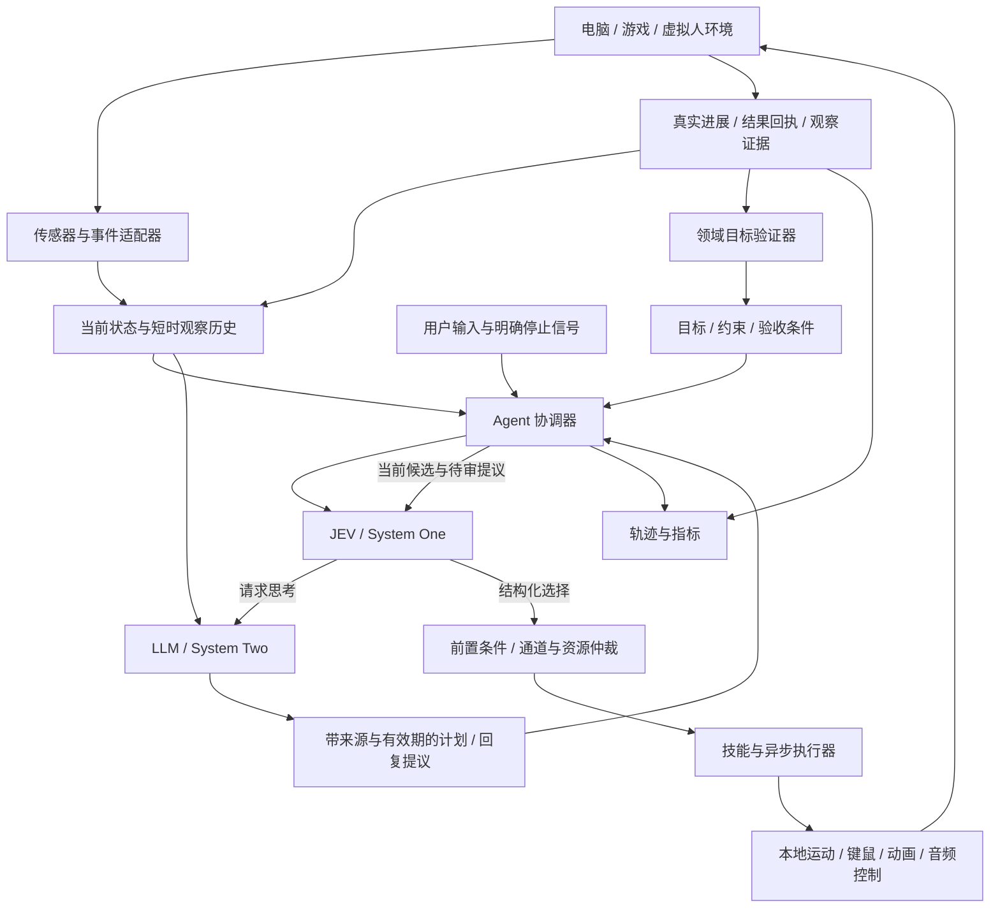

# 通用实时 Agent：架构与实施路线

日期：2026-09-20。本文保留设计时的规划基线；首批运行时、Computer 与 Home 表现已实现，实际交付范围及验证见 [实施记录](realtime-runtime-implementation.md)。文中的“拟新增”与代码行号描述规划时的状态，不代表最新文件行号。

本方案延续 [独立 Agent 架构](agent-architecture.md)，以当前 `packages/agent` 为内核、Home 为已有适配器，向电脑操控、游戏和虚拟人扩展。外部案例、日期和核验边界见 [实时 Agent 案例调研](realtime-agent-research.md)。本文中的性能数字是初始实验配置或验收目标，均不是本轮实测结果。

## 1. 项目定位与交付形态

构建一个可嵌入应用的实时 Agent 运行时：JEV 等 System One 模型持续选择当前行为，LLM 提供目标理解、计划和语言内容，环境适配器负责观察、执行和验证。本地控制器维持运动、输入与动画的连续性。

开发者接入一种环境时，提供传感器、可执行能力和目标验证器，即可复用任务管理、快慢协作、打断、并行输出和诊断。最终交付物是内核 SDK、运行宿主、参考适配器与评测工具。现有 3D 家园继续作为一个可运行的参考应用。

System One 的统一 API / SDK 服务负责模型接入与服务侧能力；本项目通过已有 `EvaluationClient` 边界使用它。账户、计费和模型 HTTP 协议不进入实时内核。未来支持其他 System One 模型时保留相同策略端口，由适配器声明能力与性能约束。

第一轮“通用”的完成定义：相同的核心协调器可以运行 Home、一个可验证的电脑任务环境和独立的表情/视线通道；新增领域无需在核心加入床、窗口名或某款游戏的对象枚举。随后以一个动态游戏环境检验其持续反应能力。

## 2. 当前代码已经提供的基础

下表依据本轮静态阅读；原文档里的历史测试成绩没有在本轮重新执行。

| 当前实现 | 代码位置 | 演进方式 |
| --- | --- | --- |
| 独立 Agent，快/慢各一个请求槽位，轮次和过期隔离 | `packages/agent/src/agent.ts:22-68,178-225,272-296` | 保留协调中心，增加截止时间、感知事件与任务作用域。 |
| 完整绑定参数的候选，Jev 通过正式 SDK 判断 | `packages/agent/src/system-one.ts:48-86` | 保留候选映射和 SDK；候选筛选、上下文压缩放在模型调用前。 |
| 执行前再次检查候选，prepare 成功后替换旧动作 | `packages/agent/src/agent.ts:199-207`、`actions.ts:40-59` | 延续这一顺序，增加设备实际状态和资源检查。 |
| 同步、有界的 start/step/cancel | `packages/agent/src/types.ts:24-34`、`actions.ts:87-130` | 增加独立异步执行协议，保留同步适配方式。 |
| 身体、输出两个并行执行器 | `packages/agent/src/agent.ts:63-65` | 演进为可注册通道，兼容现有 actions / outputs 入口。 |
| 思考先形成 proposal，采纳不等于自动执行建议 | `packages/agent/src/agent.ts:228-270` | 在其上增加目标和短计划；不把 suggestions 直接变成自动任务队列。 |
| Home 已使用内核，世界与人格策略仍由宿主管理 | `apps/realtime-home/server/runtime.ts:56-62,246-310` | 第一迁移与回归对象；不再复制一个新的 Home 调度器。 |
| 当前感知是模拟环境提供的对象信息 | `apps/realtime-home/server/agent-environment.ts:77-82`；既有架构第 7 节 | 增加独立传感器来源，保留“模拟事实”和“视觉推断”的区别。 |
| 语音先缓存音频和完整转写，审核后播放 | `apps/realtime-home/server/voice/controlled-model.ts:26-65` | 第一阶段保留保证；后续单独设计分段许可，度量首音开销。 |
| 旧 Demo 仍有自己的游戏绑定运行时 | `apps/realtime-demo/server/runtime.ts:6-23,75-100` | 作为历史比较对象，不继续把通用功能加到两套调度器中。 |

Home 当前物理推进为 100 ms，广播约 200 ms；内核默认决策开始间隔至少 1,000 ms。这些是现有场景配置，不是 JEV 能力的上限，也不能直接用于高频电脑反馈或细微表情。

## 3. 总体结构：两个认知系统与本地执行层



JEV 负责“现在选什么、要不要换、是否需要思考、如何表现”。LLM 负责“目标怎样分解、陌生情况如何解释、说什么”。代码负责可以精确计算的数值、输入时序、运动与渲染，以及副作用是否实际发生。

运行时的“实时”定义为软实时：给反应链路设定预算，过期时采取明确行为并统计违约。云端模型不承担必须每 16.7 ms 完成一次的硬截止时间；控制器的帧率与认知请求频率分别设计。

## 4. 感知契约与多速率调度

### 4.1 从一份世界快照扩展为有来源的观察

建议增加 `ObservationEnvelope`，至少包含：来源 ID、来源序号、观察 ID、采集时间、接收时间、时效预算、相关实体及版本、事实/推断标记、可观察候选，以及触发事件。原始图像、音频保留在有界缓冲区，模型上下文只取所需内容或明确引用。

不同来源分别保持顺序。不能直接比较两台机器的单调时钟；跨进程使用来源序号、UTC 采集时间与时钟误差预算，本地期限使用接收端单调时钟。存在采集/传输延迟时，不把“刚收到”当成“刚采集”。无法证明新鲜度的观察要标记为未知或失效。

连续位置和动画帧更新序号；用户目标、能力撤回和关键目标属性变化更新相关语义版本。不能每帧使全部 LLM 思考作废，也不能因忽略版本而点击一个已经移动的目标。执行时重新检查本次动作实际依赖的实体、窗口和属性。

帧快照可以合并为最新值，输入、取消确认和终态回执不能被同样丢弃。内存队列设置上限：普通观察覆盖旧帧，可靠事件溢出则进入可诊断的背压/暂停状态，不能静默遗漏一次执行结果。

### 4.2 各层按自己的时钟运行

| 层 | 初始实验配置 | 调度原则 |
| --- | --- | --- |
| 本地动画、视线、运动控制 | 30–60 Hz，具体依环境能力 | 连续推进已批准行为，不等待模型响应。 |
| 结构化传感器 | 事件优先；必要时按环境 tick 采样 | 只对决策相关变化发唤醒事件，持续保留真实状态。 |
| 截图与视觉理解 | 单独测量采集和推理预算 | 变化检测与定向识别优先；不用逐帧大模型描述充当默认路径。 |
| JEV 语义决策 | Home 保留 1 Hz 基线；新适配器先实验 2–5 Hz 上限 | 事件驱动、单请求在途、合并唤醒；频率受延迟、配额和费用限制。 |
| LLM 规划/语言 | 按需触发 | 目标变化、技能不足、失败或需生成内容时，由快系统请求。 |
| UI 与诊断推送 | 独立限频 | 不能用 UI 刷新频率作为模型时钟。 |

2–5 Hz 表示允许的请求开始频率上限，不保证单个 Agent 一定达到。如果请求耗时超过间隔，单并发会降低实际吞吐。先测输入大小、网络抖动、服务端延迟和队列等待，再决定是否提高频率；不以增加并发掩盖状态滞后。

新的 scheduler 应管理：事件优先级、请求开始间隔、决策截止时间、重试预算、每分钟调用预算、空闲降频和最短行为保持时间。收到明确停止控制信号可以立即撤销执行许可和释放可释放输入，不必等待 JEV 决定是否服从；语音开始等低层信号可停止播放，但不自动解释为新的业务行动。

动作仍有效且运行许可未到期时，LLM 思考不阻止它继续。场景要求暂停时由通道策略声明。输出倾听状态不应在所有领域无条件暂停所有身体通道；现有 Home 的 hold 行为通过兼容策略保留。

当前 core 的非合作模型 Promise 如果不结束，槽位仍被占用。扩展时应明确 provider 必须在取消/期限后收敛，并测试本地释放、迟到隔离和远程残留请求上限，避免超时后不断启动仍未结束的新请求。

### 4.3 为 JEV 准备合适的问题

保留完整绑定候选，例如 `click:save-button@v7` 对应确定的能力、目标与参数。DOM/环境在调用前筛出可见、可用、符合当前目标的候选；复杂场景先检索短名单。LLM 可提议新参数，但必须经过能力 schema、范围和执行前检查后才能成为候选。

显式保留“继续”“等待”“重新观察”“请求规划”等结果。不要因为 Choice 必须选择一个选项，就让系统在所有业务动作都不适用时仍执行其中之一。不同问题的答案由代码组合校验，紧密关联的动作采用联合候选，避免分开选择目标与动作后产生非法组合。

上下文按决策提取：当前目标、相关实体、活跃技能、最近结果和待审核提议。人格全集、完整聊天、所有对象、长历史不应每次无差别重复发送。概率和 confidence 留作评测输入；阈值按任务后果与验证集校准，不能拿固定数值承诺正确性。

## 5. System Two 返回可检查的短计划

在现有 `ThoughtProposal` 之上，增加版本化的 `PlanProposal`：目标引用、目标版本、相关观察引用、约束、下一组候选技能、依赖、失效条件与完成验证器引用。第一版限制计划深度和步骤数，不先引入复杂工作流语言。

例如“把这几张图片按内容归类”可形成“读取当前选择 → 提议分类 → 执行移动 → 核对目标目录”的短计划。LLM 返回技能引用和参数，JEV 根据新观察选择当前一步，执行器确认结果后更新任务。计划中的步骤不是预先获准、不可打断的动作队列。

目标状态与对话轮次应分开。用户问一句进展，不一定意味着取消原目标；“改放到另外一个目录”则使相关目标版本变化。由目标管理策略和快系统判断续接、替换或新增任务；旧计划不能仅因为还属于同一会话就继续执行。

任务完成需要领域验证器确认，模型 `complete=true` 只是请求验收。电脑动作的完成不等于任务目标满足；游戏到达坐标不等于完成交互；说完一句话不等于物体已经移动。

记忆分为当前工作状态、可溯源经历和已验证技能。高频帧不写入长期记忆。LLM 的反思保留为建议，只有有来源且经过宿主策略接受的内容进入持久记录。新增技能代码先经过独立开发与测试流程，再注册；生产循环不直接执行模型生成的任意代码。

## 6. 异步执行、取消与恢复

### 6.1 保留现有同步执行器，增加异步端口

不能把返回 Promise 的桌面操作塞进当前 `PreparedAction.step()`。增加异步执行端口，由本地设备驱动上报事件，内核用同一状态归约器处理同步和异步进展。下面是设计字段，不是现有导出 API：

```ts
interface OperationIdentity {
  operationId: string;
  executionId: string;
  scope: { epoch: string; turnId: string | null; revision: number };
  taskId: string | null;
  taskVersion: number;
  deviceSessionId: string;
  observationIds: string[];
}

interface ExecutionPolicy {
  resources: string[];
  interruptibility: 'immediate' | 'checkpoint' | 'noninterruptible';
  retry: 'idempotent' | 'verify-before-retry' | 'never-automatic';
  maxDurationMs: number;
}

interface ExecutionProgress {
  eventId: string;
  sourceSequence: number;
  operationId: string;
  status: 'dispatched' | 'running' | 'cancel-requested'
    | 'succeeded' | 'cancelled' | 'failed' | 'unknown';
  effect: 'none' | 'partial' | 'committed' | 'unknown';
  evidenceIds: string[];
}
```

执行状态和已发生效果分别记录。`cancelled` 可以表示持续执行已经停止，但不能抹去之前已经发生的部分效果。`succeeded` 表示能力本身完成，任务是否满足仍交给 goal verifier。

发送、设备接受、开始产生效果、完成和业务验证是不同里程碑。设备没有回执时允许 `unknown`，不能伪造成失败、成功或无副作用。无法确认释放的资源继续阻止冲突操作，直到查询恢复、设备会话重建或人工恢复确认。

### 6.2 必须保持的语义

**模型建议过期可以丢弃；执行事实迟到必须对账。** 用户改口后到达的旧点击回执仍可能反映真实页面变化。它不能完成新任务，却必须更新现场并触发重新观察。

**取消请求不是取消完成。** AbortSignal 用来终止本地等待或请求；真实设备的停止由驱动确认。新动作只有在冲突资源可用且前置条件仍满足时才能启动。发送文本、点击提交等操作不承诺能撤销。

**幂等边界写在适配器中。** 支持幂等键的远程接口可以复用 operationId；普通 GUI 点击不能因此获得 exactly-once。超时后的默认策略是查询页面/设备状态，再决定能否重试。

**持久日志进入提交路径。** 对需要恢复的远程操作，发送前持久记录意图，回执持久化后再发布可恢复的完成事件。现有 AgentEvent 监听器异常被隔离，适合投影但不能单独充当必达日志。不要因为监听器写盘失败而重放已发生副作用。

第一阶段可使用内存事件存储验证协议。引入跨进程设备宿主时，再增加宿主注入的耐久存储与恢复：重启先对账未决操作，不自动重放所有未完成命令。`hold`、动作实际运行时间、墙钟期限与网络等待时间需要分别记录，模拟倍速不能加速设备超时。

## 7. 多通道行为与虚拟人表现

将现有身体/输出扩展为注册式通道，如 `body`、`pointer`、`keyboard`、`gaze`、`face`、`voice`。通道表示行为类型，资源表示实际互斥对象；两个不同 Agent 操作同一设备时，仍由设备宿主管理同一套鼠标/键盘所有权。

键鼠操作需要有序执行和回执；表情、视线可以使用有期限的最新意图并平滑过渡。需要多个资源的动作先统一取得资源，避免拿到键盘后无限等鼠标。通道间的因果关系要明确：完成提示依赖已验证结果，口型依赖实际音频时间线。

虚拟人第一版使用结构化表现意图，例如：

```json
{
  "expression": "attentive",
  "intensity": "subtle",
  "gazeTarget": "active-speaker",
  "gesture": "small-nod",
  "durationPreset": "brief"
}
```

JEV 选择这种语义组合；本地映射表决定 blendshape 权重、插值、眼球角度、动作幅度和具体持续时间。嘴型由正在播放的音频/音素时间线驱动，眨眼和回中等维持动作由本地控制器处理。模型不逐帧生成全部骨骼参数。

角色可以在 LLM 尚未完成时转向说话者、呈现倾听状态；这些表现不能冒充“已经理解并完成任务”。对用户情绪的推断不是事实，第一版先基于明确输入和交互事件决定角色自己的表现，不依赖推测用户人格或心理状态。

Home 的整段音频校验会影响首音时延。第一阶段保留它，先用独立非语言通道改善响应。后续再实验按句或短段授权：每段绑定 proposal、scope、序号、文本与许可，先验证该段再播放，打断撤销尚未播放段；已被听到的内容无法撤销。该方案需要独立媒体测试，不直接去掉现有审核换取速度。

## 8. 三个领域如何接入

### 8.1 电脑：先可控浏览器，再真实 Windows

先新增小型浏览器任务环境，复用项目现有的 Playwright 工具链。传感器输出 DOM/可访问性信息、稳定目标 ID、可见性与可操作状态；执行器提供点击、输入、滚动和等待条件。第一批任务使用本地测试页面，包含动态弹窗、元素移动、输入中改口和结果核对。

第一条完整流程：用户要求填写并保存表单 → 复杂内容交给 LLM 形成字段提议 → JEV 选择当前控件动作 → 执行器核对目标并输入 → 页面变化回到观察 → 保存后以页面状态验收。用户中途修改要求时取消旧计划，并核对已经输入的内容。

第二步接 Windows 原生驱动，验证窗口身份、前台焦点、DPI、目标位置、键盘释放和操作结果。优先使用设备可访问性语义，截图识别作为明确的补充路径。视觉服务负责定位候选，JEV 选择候选，驱动最后核对坐标；不能让旧截图坐标在新窗口上执行。

浏览器成功不等于全桌面支持。Windows 驱动需要独立验收矩阵；macOS/Linux 属于后续不同适配器。

### 8.2 游戏：先持续变化的结构化环境，再屏幕游戏

Home 用于保留已有生活任务。新增一个有障碍、目标移动、资源变化和可中断任务的轻量环境，或接入能提供结构化状态的游戏接口。它应能让“LLM 规划期间仍需即时调整”成为真实验收要求。

示例：目标是收集物品并送达；LLM 提议路线和顺序；JEV 选择当前导航、拾取或避让技能；本地控制器处理逐 tick 移动。障碍出现后，根据新的候选切换行为，必要时重新规划。任务成功由物品和目的地状态验证。

结构化环境与纯截图环境分别评测，明确传感器能看到什么，避免把隐藏游戏状态混进“仅凭视觉”的成绩。屏幕游戏还需要稳定识别和低层运动技能，不能由增加 Jev 请求频率替代。

### 8.3 虚拟人：优先复用 Home 的 Three.js 表现

先在现有角色上增加视线、头部、表情与说话的独立通道，构建一组倾听、等待、疑惑、确认结果和被打断的情境。每种表现都由交互事件或决策驱动，测试通道是否相互阻塞。

后续再接 VRM/Live2D。AIRI 可作为适配器组织与表现实现的参考；Tavus 适合作为生成视频头像的独立渲染后端参考。保留统一语义表现意图，分别实现本地骨骼和远程生成视频映射，不假设两者能力相同。

可展示的组合场景：同一个 Agent 一边协助电脑任务，一边通过角色视线和表情反馈状态；复杂规划期间仍能响应停止与新输入。所有任务状态来自相同的执行记录。

## 9. 部署边界与复用策略

本地运行宿主负责传感器、输入设备、音频、渲染、资源仲裁和短时状态。JEV 与 LLM 可以远程调用；持久存储、会话服务和诊断采集通过端口注入。内核不依赖某一个云平台，也不假设云端进程能直接操作本地桌面。

沿用现有 System One SDK、模型提供商封装、Three.js、Playwright 与语音基础设施。在第二个场景证明某模块确实共用之前，不急于把每个内部类拆成一个包，不引入额外消息平台或独立微服务。

MCP 等工具接入可以封装为能力适配器，但工具协议本身不提供本项目所需的动作时限、资源占用和结果验收。由运行时补齐这些语义；具体工具是否支持取消、幂等和进度，必须按接口实际能力声明。

## 10. 可执行的模块拆分

下表保留规划时的模块拆分。已交付的模块与剩余阶段以实施记录为准。

| 位置 | 建议工作 | 验收重点 |
| --- | --- | --- |
| `packages/agent/src/types.ts` | 新增观察、任务、异步事件和通道契约；旧类型继续兼容。 | 旧 Home 的公开调用方式仍可工作。 |
| `packages/agent/src/observations.ts`（拟新增） | 多来源观察、时效与实体版本、短时缓冲。 | 旧帧可合并，终态事件不可丢；相关版本准确失效。 |
| `packages/agent/src/scheduler.ts`（拟新增） | 从 Agent 渐进抽出事件、预算与期限管理。 | 单并发、退避与取消不回退；输入突发不积压旧决策。 |
| `packages/agent/src/executions.ts`（拟新增） | 异步事件归约、取消确认、unknown 与查询恢复。 | 迟到回执入账、重复回执不重复结算。 |
| `packages/agent/src/channels.ts`（拟新增） | 通道注册和资源声明；兼容 actions / outputs。 | 语音与视线并行，冲突键鼠互斥。 |
| `packages/agent/src/tasks.ts`（拟新增） | 目标版本、短计划、验证器、失效与重规划。 | 旧步骤不继续，业务目标由证据验收。 |
| `apps/realtime-home` | 迁移兼容策略并增加基础表现通道。 | 现有观察、说话、改口和世界效果不回退。 |
| `apps/realtime-computer`（拟新增） | 浏览器参考应用与设备宿主集成。 | 动态页面真实操作与结果核对。 |
| `apps/realtime-arena`（拟新增） | 动态游戏参考环境与故障注入。 | 规划期间保持动作连续，目标变化可响应。 |
| `packages/adapters/*`（证明复用后再新增） | 提取浏览器、Windows、Avatar、游戏适配器。 | 核心无需领域对象与 UI 依赖。 |
| `scripts/` 与相关包测试目录 | 离线轨迹、闭环评测、指标汇总。 | 可重现同任务、同输入权限、同执行器的对照结果。 |

## 11. 分阶段交付与退出条件

| 阶段 | 具体交付 | 完成条件 |
| --- | --- | --- |
| P0：固定基线 | 整理 Home 的真实链路时序；补采集/排队/审核/执行等观测点；定义三领域任务集。 | 能把一次任务时间分解，明确模拟模型、真实模型和真实设备各自覆盖范围。 |
| P1：运行时扩展 | 观察事件、期限预算、异步执行协议、多通道；保留同步 Home。 | 过期决策、取消竞态、重复回执、资源冲突均有确定性测试；Home 回归通过。 |
| P2：第二领域闭环 | 可控浏览器任务 + 最小目标计划/验证器；在 Home 中增加表情与视线。 | 相同核心完成电脑任务；LLM 等待时能表现与打断；页面变化不执行过期候选。 |
| P3：真实动态场景 | Windows 驱动、小型动态游戏、需要跨进程时的持久对账。 | 三类场景各有成功、失败、改口、失联恢复轨迹；设备故障后不盲目重放。 |
| P4：对照评测与 SDK 整理 | 抽取经验证的适配器，完成多 Agent 资源与预算评测，整理发布接口。 | 双系统相对基线的延迟、完成率、费用与局限有数据；未验证的平台明确标注。 |

每阶段完成后再扩大领域或并发。P2 的表情实现可以与电脑适配并行开发，但都依赖 P1 的通道契约。复杂持久工作流、多 Agent 分布式协作和任意游戏视觉控制不作为首轮完成前提。

## 12. 评测：证明收益发生在哪里

### 12.1 统一时间与成本口径

对同一任务记录：采集、接收、入队、决策开始/结束、校验、发送、设备确认、首个可见效果、操作完成、目标验证、语音许可、音频首帧和播放结束。使用关联 ID 将这些事件连起来。

核心指标是：目标成功率、输入到首个有效动作的 P50/P95/P99、执行时观察年龄、明确停止到设备确认的延迟、期限违约率、无进展/抖动次数、失效决策比例、LLM 升级次数、每分钟调用量、输入大小和每个成功任务的实际费用。虚拟人另测首个非语言反应、首音时间和媒体同步，不能互相代替。

预算拆分为：

```text
有效动作反应时间 = 感知延迟 + 排队时间 + JEV 调用
                 + 校验/仲裁 + 设备产生首个有效效果

目标完成时间 = 任务内各步骤、等待、失败恢复与验证的实际总耗时
```

连续在线场景另报每 Agent 小时费用，包含空闲、失败、视觉、语音和 LLM 请求。价格取实际账单/供应商用量记录；无价格信息时保持未知，不用单次决策价格推导整体收益。

### 12.2 初始验收目标

以下是受控环境的拟定目标，P0 建立基线后再确认，不是供应商保证：

| 项目 | 初始目标或判定方式 |
| --- | --- |
| 本地非语言响应 | 从本地事件接收到开始表现，P95 不超过 100 ms；单独报告传感器前置延迟。 |
| 本地动画连续性 | 在指定设备上达到目标 60 FPS，并报告帧时间 P95；设备规格随报告保存。 |
| 结构化状态到有效动作 | 初始软期限 500 ms；逐项报告满足率及违约原因，若不可达则调整场景或部署。 |
| 明确停止 | 记录请求与确认两个时间；本地可中断执行初始以 P95 100 ms 为目标；远程与不可中断操作单列。 |
| 错误执行 | 确定性竞态测试中，旧决策执行、重复结算和伪造完成均为零；这不是对所有生产输入的零错误承诺。 |
| 目标能力 | 成功率与完成时长相对基线比较；失败样本必须分类，不以“模型返回成功”计分。 |

### 12.3 对照组与测试矩阵

至少比较 JEV-only、LLM-only、JEV + LLM；已有脚本策略作为可选控制组。三组使用相同传感器权限、候选、执行器、初始状态和任务分布。既做相同资源预算比较，也报告各自合理配置下的表现，避免故意给 LLM-only 加不必要的长提示或等待。

每步都需要全新语言生成、几乎每次决策都升级 LLM，或感知本身依赖慢速视觉推理时，双系统可能增加审核轮次而没有速度收益。这是需要测量的适用边界；用数据调整场景配置，不把“多一个快模型”直接当成整体更快的证明。

测试包括正常任务、执行中改口、目标移动、观察缺失、模型延迟、模型不响应取消、请求错误、执行超时、迟到回执、重复回执、断线重连、执行提交前后崩溃以及观察事件风暴。持久化阶段重点验证“副作用已发生但完成事件尚未对外发布”的恢复。

离线事件重放用于验证调度和状态机确定性。评价新策略的任务能力需要重新运行可交互环境：旧策略产生的后续录像不能当成另一策略采取不同动作后的真实世界。真实模型评测分离于普通测试，记录版本、地区、输入规模、任务数、随机种子和费用上限。首轮建议每领域固定任务集进行多轮重复，并在扩大样本前报告置信区间与失败类型。

## 13. 第一批实施切片

优先完成三个可审阅的增量：

1. 增加观察/执行的时间记录和故障夹具，固定 Home 的回归行为与费用口径。
2. 引入异步执行事件及通道资源契约，用可控本地执行器证明取消确认、unknown 恢复和迟到回执的语义。
3. 用同一核心跑通动态表单任务，并让 Home 角色在规划与执行过程中独立表现倾听、等待和结果反馈。

这三个切片完成后，就能用代码和体验判断抽象是否成立，再扩到真实 Windows 和动态游戏。阶段推进以验收结果为依据。
